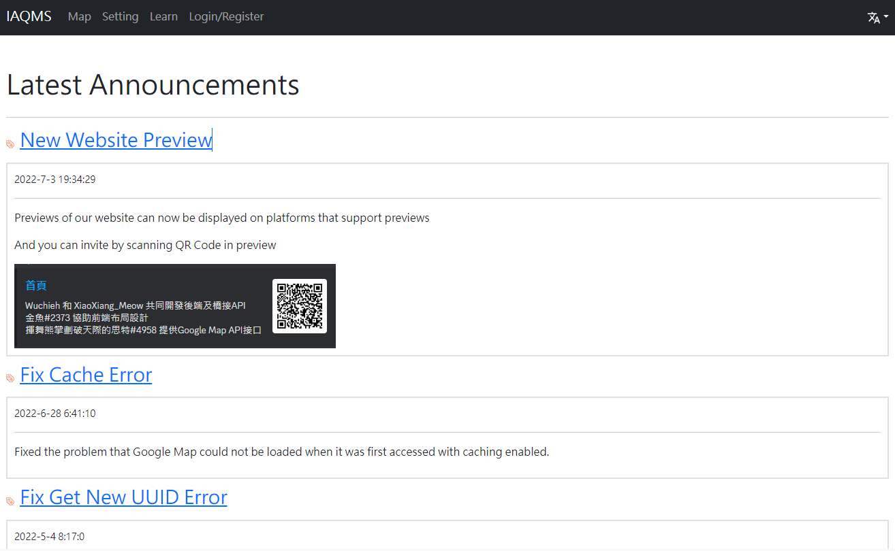
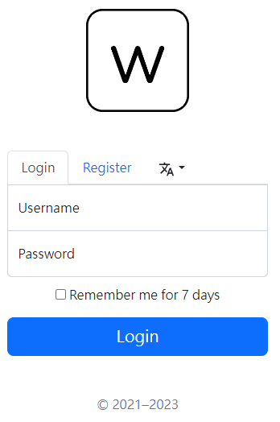

# Intelligent Air Quality Monitoring System v2 (FontEnd)

## [System Backend](https://github.com/Wuchieh/IntelligentAirQualityMonitoringSystem)

English | [繁體中文](README_tw.md)

&emsp;

## Technology Stack
- Bootstrap v5.2.3
- Google Maps JavaScript API
- Vue.js v3
- Vue Router
- Vue I18n
- Axios
## Require
- Web 瀏覽器
## Function
- Mark the location of the monitoring station on the map
- Display air quality data from monitoring stations
- Ability to change language (Traditional Chinese, English)
- Identity Verification
- Display the user's settings
## Usage
- Move to the project's directory in the command line tool
- Run `yarn` to install the necessary packages
- Run `yarn dev` and start front-end web preview mode

## Screen Preview

