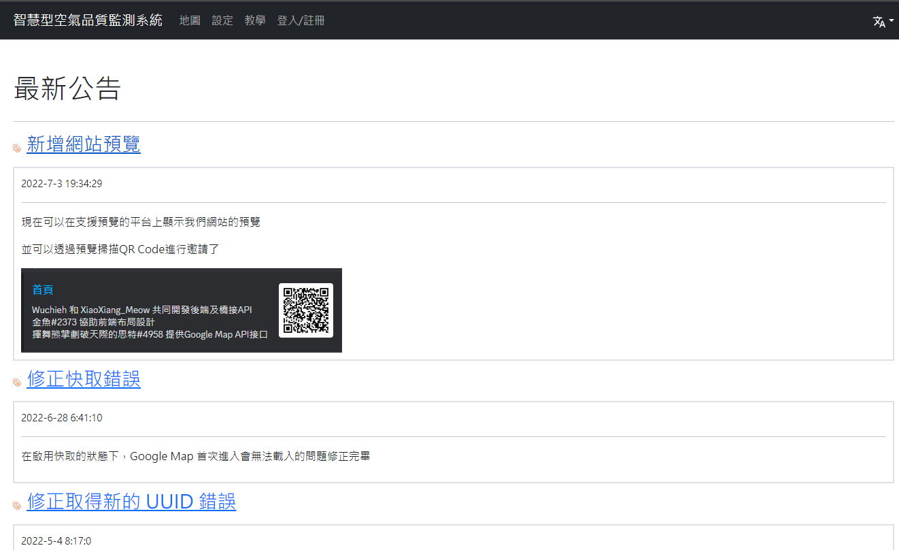
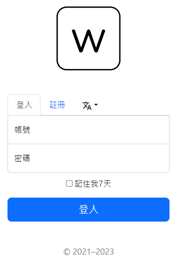

# 智慧型空氣品質監測系統 v2 (前端)

## [系統後端](https://github.com/Wuchieh/IntelligentAirQualityMonitoringSystem)

[English](README.md) | 繁體中文

<a href="https://github.com/wuchieh"></a>
&emsp;
<a href="https://github.com/MeowXiaoXiang"></a>

## 作者
- [Wuchieh](https://github.com/wuchieh)
- [MeowXiaoXiang](https://github.com/MeowXiaoXiang)

## 技術棧
- Bootstrap v5.2.3
- Google Maps JavaScript API
- Vue.js v3
- Vue Router
- Vue I18n
- Axios

## 需求
- Web 瀏覽器

## 功能
- 在地圖上標示監測站的位置
- 顯示監測站的空氣品質資料
- 可以更改語言（繁體中文、英文）
- 身分驗證
- 顯示使用者的設定內容

## 安裝

### 先決條件
- 安裝 [Node.js](https://nodejs.org/)（版本 14 或更高）

### 步驟
1. 在命令列工具中移動到專案的目錄。
2. 啟用 Corepack：
   ```sh
   corepack enable
   ```
3. 準備並啟用特定版本的 Yarn：
   ```sh
   corepack prepare yarn@3.6.0 --activate
   ```
4. 安裝必要的套件：
   ```sh
   yarn install
   ```

## 設定

1. 將 `src/components/Map.vue` 中第 169 行的 `apiKey` 替換為你自己的 Google Maps JavaScript API 金鑰。
2. 在你的 Google Cloud 專案中啟用 Maps JavaScript API 和 Places API。

## 執行應用程式

要啟動前端網站預覽模式，請使用以下命令：
```sh
yarn dev
```

要構建生產環境的應用程式，請使用以下命令：
```sh
yarn build
```
這將在 [`dist`] 目錄中生成生產環境準備好的文件。然後你可以使用你偏好的網頁伺服器來提供這些文件。

### 解釋
- `corepack enable`：啟用 Corepack，這是一個管理包管理器（如 Yarn）的工具。
- `corepack prepare yarn@3.6.0 --activate`：準備並啟用 Yarn 版本 3.6.0。
- `yarn install`：安裝 [`package.json`] 文件中列出的所有依賴項。
- `yarn dev`：啟動前端應用程式的開發伺服器。
- `yarn build`：構建生產環境的應用程式並將文件輸出到 [`dist`] 目錄。

## 畫面預覽


